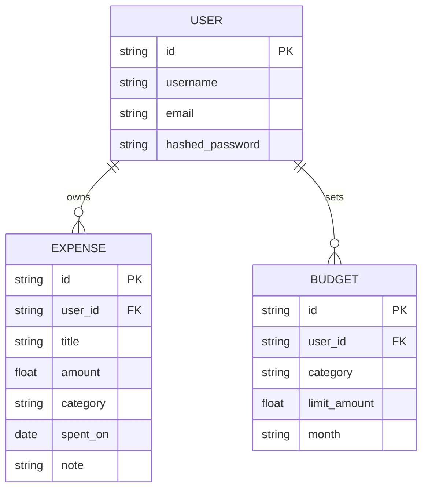
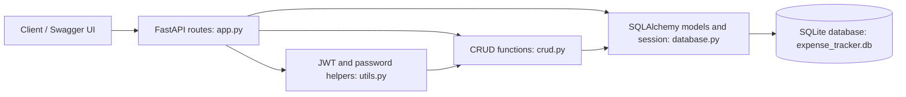

# Expense Tracker Diagrams

## ER Diagram

```mermaid
erDiagram
    USER ||--o{ EXPENSE : owns
    USER ||--o{ BUDGET : sets

    USER {
        string id PK
        string username
        string email
        string hashed_password
    }

    EXPENSE {
        string id PK
        string user_id FK
        string title
        float amount
        string category
        date spent_on
        string note
    }

    BUDGET {
        string id PK
        string user_id FK
        string category
        float limit_amount
        string month
    }
```

## Simple Schema / Flow

```mermaid
flowchart LR
    Client[Client / Swagger UI]
    API[FastAPI routes: app.py]
    JWT[JWT and password helpers: utils.py]
    DBLayer[SQLAlchemy models and session: database.py]
    CRUD[CRUD functions: crud.py]
    DB[(SQLite database: expense_tracker.db)]

    Client --> API
    API --> JWT
    API --> CRUD
    API --> DBLayer
    JWT --> CRUD
    CRUD --> DBLayer
    DBLayer --> DB
```
