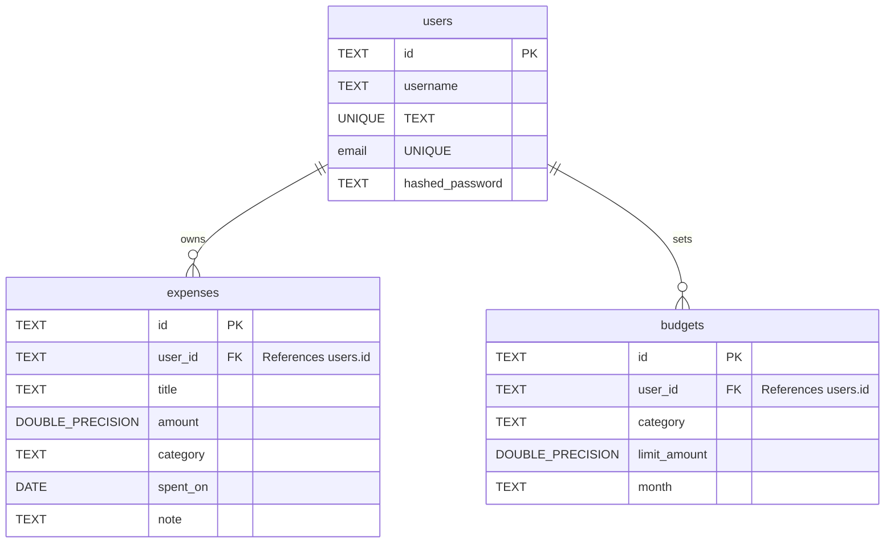

# Expense Tracker Diagrams & Architecture

This document provides visual models of the PostgreSQL schema and the serverless architecture of the application.

## Schema (ER) Diagram

The database uses PostgreSQL with a relational schema. Users can own multiple expenses and set multiple budgets.



---

## System Architecture

The application is built to run on serverless environments like Vercel with a stateless architecture, connecting to a PostgreSQL database (e.g., Neon or local PostgreSQL).

```mermaid
flowchart TD
    subgraph Client [Client Side / Web Browser]
        UI[Single Page App: index.html]
        Storage[(Local Storage: JWT Tokens)]
        UI -.->|Read/Write Tokens| Storage
    end

    subgraph APIHost [API Hosting Environment]
        subgraph Vercel [Vercel Serverless Platform (Prod)]
            Func[FastAPI App: app/app.py]
            Handler[Vercel Python Builder: @vercel/python]
            Handler --> Func
        end
        
        subgraph LocalHost [Local Machine (Dev)]
            Uvi[Uvicorn Server]
            LocalApp[FastAPI App: app/app.py]
            Uvi --> LocalApp
        end
    end

    subgraph DBHost [Database Hosting]
        Neon[(PostgreSQL: Neon / Vercel Postgres)]
        LocalDB[(PostgreSQL: Local Instance)]
    end

    subgraph Logic [Application Core Services]
        JWT[Auth Services: app/utils.py]
        CRUD[CRUD Engine: app/crud.py]
        ConnPool[Connection Pool: app/database.py]
    end

    %% Routing
    UI -->|HTTPS Requests| Handler
    UI -->|HTTP Requests| Uvi
    
    Func & LocalApp --> JWT
    Func & LocalApp --> CRUD
    CRUD --> ConnPool
    
    %% DB Connections
    ConnPool -.->|Production Connection| Neon
    ConnPool -.->|Development Connection| LocalDB
```
